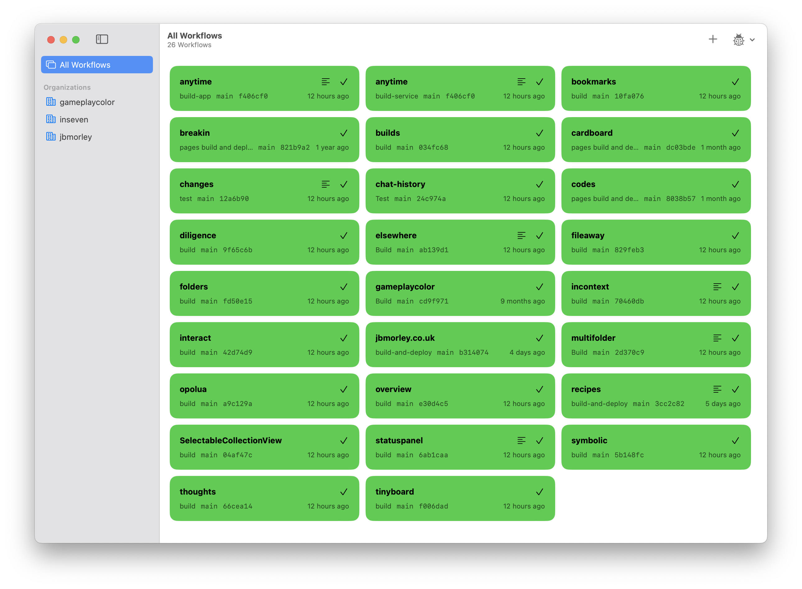
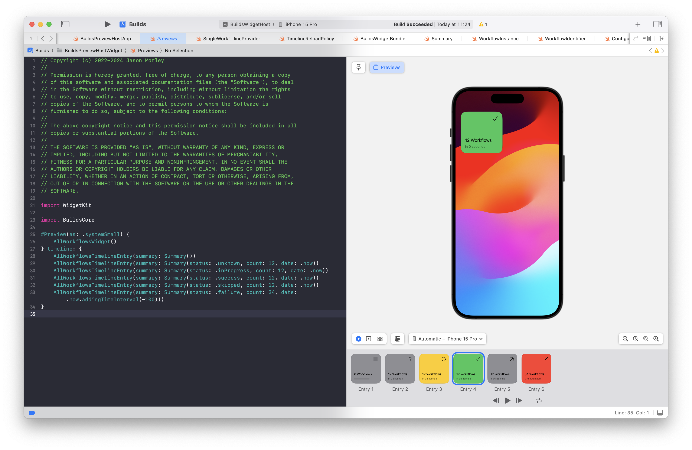

# Builds

GitHub Actions status board for macOS and iOS.

## Development

Builds follows the version numbering, build and signing conventions for InSeven apps. Further details can be found [here](https://github.com/inseven/build-documentation).

### SwiftUI Previews

Builds relies on SwiftUI previews to test all the different widget scenarios. Unfortunately there's an Xcode bug which stops previews from working in the Builds app itself (Xcode is determined to try to compile SelectableCollectionView's macOS XIB for iOS even though Package.swift makes it conditional on macOS). To work around this, Builds contains two additional targets (BuildsPreviewHost and BuildsPreviewHostWidgetExtension) which link only BuildsCore and exist for the express purpose of generating previews. Previews are declared in 'Preview.swift' in the respective apps. These two targets are built in CI to ensure they're not unintentionally broken during regular development.

## Licensing

Builds is licensed under the MIT License (see [LICENSE](LICENSE)).
